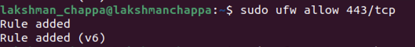

# Network Security – Assignment 5

This is about enabling and configuring UFW (Uncomplicated Firewall) on my Ubuntu VM. I followed the steps, took screenshots of the outputs, and wrote short notes on what I saw.

Part I: Enable UFW
1) Check UFW status
sudo ufw status
What I saw:
Status was active at first.But something went wrong with my VM . i have downloaded it again and started doing it from first and then the status was inactive

My note:
UFW wasn’t running by default, so I had to enable it.

2) Allow SSH before enabling
Command:

sudo ufw allow 22/tcp
What I saw:
Output:
Skipping adding existing rule
Skipping adding existing rule (v6)
My note:
SSH was already allowed, so UFW skipped adding duplicates. This is important to make sure I don’t lock myself out when enabling UFW.

3) Check open ports
Command:
sudo ss -tuln
What I saw:
Services like DNS (53), DHCP (68), Avahi/MDNS (5353), and CUPS (631) were listening.

My note:
This shows which services my VM has open. SSH wasn’t listed because it wasn’t running at that moment.

4) Enable UFW
Command:

sudo ufw enable
What I saw:
Message: Firewall is active and enabled on system startup

My note:
This turned on UFW so it now enforces rules.

5) Check status again
Command:

sudo ufw status
What I saw:
Status changed to active.

My note:
Now the firewall is running and ready to filter traffic.

6) Allow web server ports
Command:

sudo ufw allow 80/tcp
sudo ufw allow 443/tcp
What I saw:
Rules were added for HTTP (80) and HTTPS (443).

My note:
These are the ports needed for web servers, so I allowed them.

7) Check verbose status
Command:

sudo ufw status verbose
What I saw:

Default policy: deny incoming, allow outgoing

Logging was on (low at first, later changed to high)

Rules showed SSH, HTTP, HTTPS allowed

My note:
Verbose status is more detailed, showing both defaults and my rules.

8) Block a specific IP
Command:

sudo ufw deny from 10.0.0.0
What I saw:
Rule added to deny traffic from that IP.

My note:
This blocks traffic from a malicious or untrusted IP address.

9) Allow a specific IP on port 587
Command:

sudo ufw allow from 192.168.1.50 to any port 587
What I saw:
Rule added to allow that host.

My note:
Port 587 is used for sending email (SMTP submission). This command allows only one host to use that port.

10) Check rules again
Command:

sudo ufw status
What I saw:
Rules listed for SSH (22), HTTP (80), HTTPS (443), deny 10.0.0.0, and allow 192.168.1.50 on port 587.

My note:
This confirmed that all the rules I added are in place.

Part II: Enable UFW Logging
1) Enable logging
Command:

sudo ufw logging on
What I saw:
Logging was enabled.

My note:
This makes UFW record allowed and blocked packets.

2) Set logging level
Command:

sudo ufw logging high
What I saw:
Logging set to high.

My note:
High logging shows more packet details so I can see what’s happening.

3) View recent logs
Command:

sudo tail -n 20 /var/log/ufw.log
What I saw:
Mostly [UFW AUDIT] and [UFW ALLOW] entries for DNS (53) and Avahi (5353).

My note:
This shows normal background network activity. Nothing suspicious.

4) Check for denied traffic
Command:

sudo grep 'DENY' /var/log/ufw.log | tail -n 10
What I saw:
No DENY results.

My note:
That makes sense — nothing tried to connect on blocked ports yet.

5) Check for allowed traffic
Command:

sudo grep 'ALLOW' /var/log/ufw.log | tail -n 10
What I saw:
Several [UFW ALLOW] entries for DNS and multicast traffic.

My note:
This confirms that UFW is letting normal traffic through.

